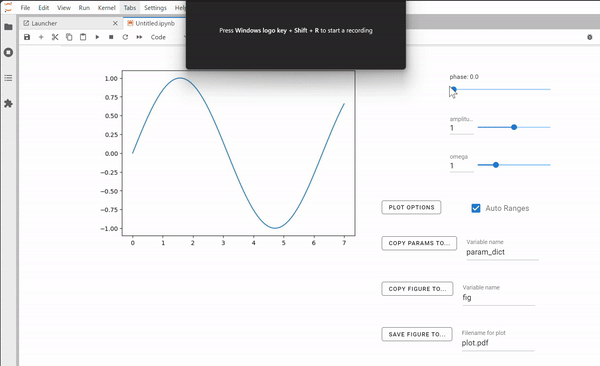

.. suraida
   Copyright (C) 2024, Jens Koch

suraida documentation
======================

suraida is a lightweight open-source Python library package for interactive plotting,  similar to Mathematica's
`Manipulate`.

.. code-block:: python

   import suraida as sr
   import numpy as np

   def func(z, amplitude, omega, phase):
       return amplitude * np.sin(omega * z + phase)

   sr.Manipulate(func,                          # the numerical function we wish to plot and manipulate parameters via sliders
                 var_def=["z", 0, 7, 0.1],      # definition of the variable against which to plot `func`, specifying min, max and step
                 param_defs=[
                     ["phase", [i*np.pi/5 for i in range(5)]],      # phase as list of allowed values
                     ["amplitude", 0, 2, 0.1],                # amplitude with min, max and step, default initial value is midpoint between min and max
                     ["omega", 0, 4, 0.1, 1.0]                # omega with min, max, step, ini
                 ]
                )

Getting Started
***************

After :ref:`install` of suraida, check out the :ref:`Example`.

.. toctree::
   :hidden:

   ./example/example.ipynb
   installation.rst
   api-doc/apidoc.rst
   changelog.rst
   contributors.rst
